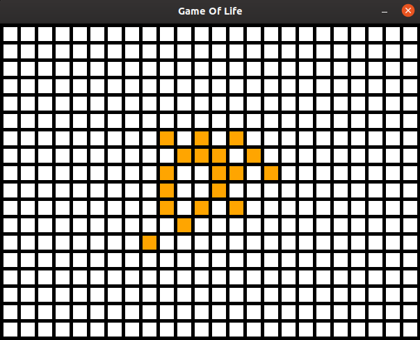

# Python Game Of Life

Made by: Ryan Kenneth Cabrera  
Using: Python, Pygame

## Screenshots

## Controls
* Space - Start / Pause / Resume Generation 
* R - Reset The Game
* Mouse Click - Add Alive Cell